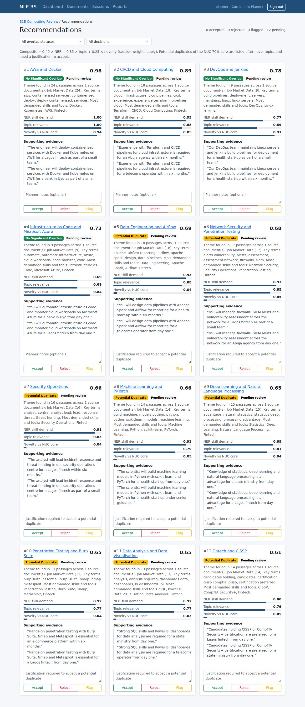

# NLP-Driven Curriculum Recommendation System (NLP-RS)

This web application analyses job adverts, policy documents, institutional
materials and academic literature, and recommends topics for the **NUC CCMAS
30% localised curriculum**. Each candidate topic is checked for semantic
overlap with the NUC-prescribed 70% core.

The case study is the Department of Computer Science, Faculty of Computing,
University of Uyo.

- Developer guide (specification): [`docs/NLP_RS_Developer_Documentation.docx`](docs/NLP_RS_Developer_Documentation.docx)
- **[Run a demo on your own computer](docs/LOCAL_DEMO.md)** (Docker Desktop, about 20 minutes the first time)
- [API reference](docs/API.md) · [Database](docs/DATABASE.md) · [Deployment and operations](docs/DEPLOYMENT.md)
- [Implementation decisions](docs/DECISIONS.md) (including the gaps listed in guide §21)
- [Definition of Done status](docs/DEFINITION_OF_DONE.md) (spec §22)
- [Evaluation data formats](data/evaluation/README.md) (spec §17)

## Status

| Sprint | Scope | State |
|--------|-------|-------|
| 1 | Project setup, database foundation, auth, RBAC, audit, error model | ✅ Done |
| 2 | Document upload, validation, parsing, preprocessing, session creation | ✅ Done |
| 3 | TF-IDF, NER, SBERT, BERTopic, background jobs, results APIs | ✅ Done |
| 4 | Semantic overlap, recommendation engine, planner decisions | ✅ Done |
| 5 | Curriculum mapping, PDF/DOCX reports, admin APIs, Vue frontend, end-to-end tests | ✅ Done |
| 6 | Evaluation toolkit (§17), security hardening, stale-run recovery, production deployment, documentation | ✅ Done |

## Stack

Python 3.11 · Flask · SQLAlchemy / Alembic · PostgreSQL · Celery + Redis ·
spaCy · scikit-learn · Sentence-Transformers · BERTopic · reportlab ·
Vue 3 + Vite + Bootstrap 5 + Pinia · Playwright · Docker Compose · Nginx



## Local development

Requirements: Python 3.11 and PostgreSQL 16 (or Docker).

```bash
python3.11 -m venv .venv && source .venv/bin/activate
cd backend
pip install torch --index-url https://download.pytorch.org/whl/cpu   # CPU-only torch
pip install -r requirements-dev.txt
cp .env.example .env            # then edit DATABASE_URL / SECRET_KEY

createdb nlprs                  # or use the postgres container below
flask db upgrade                # apply migrations
flask create-user --username admin --email admin@example.com --role Admin
flask run                       # http://127.0.0.1:5000/api/health
```

### Tests

```bash
cd backend
python -m pytest --cov=app                       # uses in-memory SQLite
TEST_DATABASE_URL=postgresql+psycopg2://... python -m pytest   # against PostgreSQL
```

CI (`.github/workflows/backend-tests.yml`) runs the migrations and the test
suite against PostgreSQL 16. It fails if coverage drops below 85%, the target
in guide §17.5.

### Background worker (local)

```bash
redis-server &                                   # or: docker run -p 6379:6379 redis:7
cd backend && celery -A celery_worker.celery worker --loglevel=info --concurrency=1
```

At startup each worker loads spaCy and SBERT and triggers UMAP's JIT
compilation. Without that warm-up, the first analysis in each worker takes
about 20 s longer.

Without internet access to Hugging Face, set `EMBEDDING_BACKEND=hashing` to
exercise the pipeline. The results are then lexical rather than semantic and
are flagged with a warning.

### Docker Compose (development)

For production (HTTPS, required secrets, restart policies, backups) see
[docs/DEPLOYMENT.md](docs/DEPLOYMENT.md).


```bash
docker compose up --build        # postgres, redis, backend, worker, scheduler, frontend (Nginx)
docker compose exec backend flask db upgrade
docker compose exec backend flask create-user
open http://localhost:8080       # the app; /api/* is proxied to Flask
```

## API (implemented so far)

All errors use the same shape:
`{"success": false, "error": {"code", "message", "details"}}`

| Method | Endpoint | Auth | Purpose |
|--------|----------|------|---------|
| GET | `/api/health` | – | Liveness and database check |
| POST | `/api/auth/login` | – | `{username, password, remember?}` → sets session cookie |
| POST | `/api/auth/logout` | any role | End the session |
| GET | `/api/auth/me` | any role | Current user |
| GET | `/api/documents` | any role | List documents. Filters: `source_category`, `status`, `q` (title search), `mine=1`. Paginated with `page` and `per_page`. |
| POST | `/api/documents` | Planner, Admin | Multipart upload with `file`, `source_category` and an optional `title`. The file is validated, stored and parsed immediately. |
| GET | `/api/documents/{id}` | any role | Document metadata, processing status and parse error |
| GET | `/api/documents/{id}/text` | any role | Extracted text. `?view=clean` applies the noise cleanup. |
| DELETE | `/api/documents/{id}` | owner or Admin | Delete a document and its file. Not allowed while a processing session uses it. |
| GET | `/api/sessions` | any role | List sessions. Filters: `status`, `mine=1`. |
| POST | `/api/sessions` | Planner, Admin | `{session_name, document_ids, parameter_config?}`: up to 50 documents, all of which must be parsed |
| GET | `/api/sessions/{id}` | any role | Session detail, including `document_ids` in processing order |
| DELETE | `/api/sessions/{id}` | owner or Admin | Delete a session. Not allowed while it is processing. |
| POST | `/api/sessions/{id}/run` | owner or Admin | Queue the NLP pipeline and return **202** at once. Allowed only from `Pending` or `Failed`, and only when the library has at least one parsed NUC Core Reference document (otherwise `409 NO_CORE_REFERENCE`). |
| GET | `/api/sessions/{id}/results` | any role | All NLP output: pipeline info, corpus results and per-document results |
| GET | `/api/sessions/{id}/keywords` | any role | TF-IDF keywords for the corpus and for each document |
| GET | `/api/sessions/{id}/entities` | any role | Skill demand and per-document entities. `?label=SKILL\|TOOL\|CERT\|ORG\|PRODUCT\|GPE` filters by type. |
| GET | `/api/sessions/{id}/topics` | any role | BERTopic topics (label, keywords, size, relevance, representative passages) and each document's topic shares |
| GET | `/api/sessions/{id}/recommendations` | any role | Ranked recommendations. Filters: `overlap_status`, `decision` (`Accepted`, `Rejected`, `Flagged` or `pending`), `include_evidence=1`. |
| GET | `/api/sessions/{id}/similarity` | any role | Overlap results: threshold, core documents used, and each recommendation's closest core segments |
| GET | `/api/recommendations/{id}` | any role | One recommendation with its evidence (source topic, passages, documents, skills, core matches) |
| PATCH | `/api/recommendations/{id}/decision` | session owner or Admin | `{decision: Accepted\|Rejected\|Flagged\|null, notes?}`. Accepting a potential duplicate requires notes. |
| PATCH | `/api/recommendations/{id}` | session owner or Admin | Rename a recommendation or edit its description |
| GET/POST | `/api/recommendations/{id}/mapping` | read: any role; create: owner or Admin | Proposed courses for an **Accepted** recommendation: `{course_code, course_title, credit_units: 1-3, prerequisites[], learning_outcomes[]}` |
| GET/PUT/DELETE | `/api/mappings/{id}` | read: any role; change: owner or Admin | Read, update or delete one mapping. Course codes are normalised (`csc413` becomes `CSC 413`) and must be unique within a session. |
| GET | `/api/sessions/{id}/mappings` | any role | Every course mapping in a session |
| POST | `/api/sessions/{id}/reports` | Planner, Admin | `{format: "pdf"\|"docx"}`. Generates and stores a report and returns 201. |
| GET | `/api/reports`, `/api/reports/{id}` | any role | Report history (`?session_id=` filter) and metadata |
| GET | `/api/reports/{id}/download` | any role | The report file |
| GET | `/api/dashboard/summary` | any role | Counts, recent sessions, the current user's pending reviews, and whether a core reference exists |
| GET/POST | `/api/admin/users` | Admin | List or create users |
| PATCH | `/api/admin/users/{id}` | Admin | Change role, active status, email or password. Admins cannot demote or deactivate themselves. |
| GET | `/api/admin/audit` | Admin | Audit log. Filters: `user_id`, `action_type`, `entity_type`, `from`, `to`. |

While a run is in progress, `GET /api/sessions/{id}` returns
`progress: {stage, step, total_steps}`. The stages are queued → parsing →
preprocessing → keywords → entities → embeddings → topics → overlap →
scoring → saving. Results
endpoints return `409 RESULTS_NOT_READY` until the session is `Completed`.

Uploads are checked for extension *and* file content (a renamed `.exe` is
rejected), a 25 MB limit, and exact duplicates (SHA-256). Only Admins can
upload or delete **NUC Core Reference** documents.

Roles: **Admin** (full access), **Curriculum Planner** (upload, run, review,
map, report), **Viewer** (read-only). Roles are enforced on the server with
`app.utils.rbac.roles_required`.

## Document processing

| Stage | Module | What it does |
|-------|--------|--------------|
| Parse | `services/ingestion/parsers.py` | PDF (PyMuPDF): extracts text page by page, drops running headers, footers and page numbers, and re-joins words hyphenated across line breaks. DOCX (python-docx): extracts body paragraphs and tables in reading order, skipping headers and footers. TXT: decodes UTF-8, falling back to cp1252. |
| Clean | `services/preprocessing/normalize.py` | NFKC normalisation, standardised quotes and dashes, and removal of invisible characters, URLs, emails, table-of-contents entries (with or without page numbers) and lines with no letters |
| Preprocess | `services/preprocessing/pipeline.py` | spaCy `en_core_web_sm` produces normalised sentences (used for SBERT and NER) and lowercased content-word lemmas with stop words removed (used for TF-IDF) |
| TF-IDF | `services/tfidf/` | scikit-learn keywords (unigrams and bigrams, sublinear TF) for each document and for the corpus. Terms found in more than 90% of documents are dropped when there are 5 or more documents. |
| NER | `services/ner/` | spaCy NER plus an EntityRuler with about 250 curated Computing patterns labelled `SKILL`, `TOOL` or `CERT` (`patterns.py`). Also keeps the standard `ORG`, `PRODUCT` and `GPE` labels. Skill demand counts total mentions and how many documents mention each skill. |
| Embeddings | `services/embeddings/` | SBERT `all-MiniLM-L6-v2`. `EMBEDDING_BACKEND=hashing` is a deterministic lexical stand-in for tests and offline development only. |
| Topics | `services/topics/` | BERTopic (UMAP → HDBSCAN → BM25 c-TF-IDF) over sentence-level passages, using our own embeddings. Each topic has a label, keywords, size, a 0–1 relevance score, the 3 passages closest to its centroid, document and source-category counts, and a centroid embedding. |
| Orchestration | `services/analysis.py`, `tasks/` | Celery task that runs the stages, records progress and timings, and saves the output. Any failure marks the session `Failed` with the error message and writes an audit entry. |

NUC Core Reference documents in a session are processed, but kept out of skill
demand, corpus keywords and topics. They are the baseline for overlap
detection.

## Recommendations

Each BERTopic topic becomes a candidate curriculum topic. It carries the
topic's centroid embedding, its evidence passages, and the skills and tools
mentioned in those passages.

1. **Overlap** (`services/similarity/`): every parsed NUC Core Reference
   document in the library is split into segments (course titles, outlines,
   sentences) and embedded, with a cache per worker process. For each
   candidate, `max_similarity` is its highest cosine similarity to any core
   segment and `novelty = 1 − max_similarity`. Above the session threshold
   (default 0.80) the candidate is marked **Potential Duplicate**, and its 3
   closest core segments are kept as evidence.
2. **Scores** (`services/recommendations/`), each normalised to 0–1 across the
   session's candidates:
   - `ner_score = log(1+m) / log(1+max m)`, where *m* is the number of
     SKILL/TOOL/CERT mentions in the candidate's passages
   - `topic_score` = the average of the candidate's passage share and
     document spread, each relative to the session's largest
   - `novelty_score` = 1 − max similarity
3. **Composite** `= 0.40·NER + 0.35·Topic + 0.25·Novelty` (the weights come
   from the session's `parameter_config`).
4. **Ranking:** novel candidates come first by composite score, then potential
   duplicates. The list is capped at `max_recommendations` (default 20).
5. **Title:** the dominant skill's name (found in at least 20% of the topic's
   passages; skills before tools), for example "Cloud Computing and
   Kubernetes". If there is none, the topic label is used.

Scanned (image-only) PDFs are marked `Failed` with a clear reason. OCR is out
of scope.

## Frontend

Vue 3 single-page app (`frontend/`) with every route in spec §13: login,
dashboard, document library, sessions, session detail with live progress,
evidence dashboard (skills, keywords, themes, overlap), recommendation cards
with accept/reject/flag, recommendation detail, curriculum mapping, reports,
user management and the audit log. Controls are hidden for roles that can't
use them, but the API enforces every rule regardless.

```bash
cd frontend
npm install
npm run dev          # http://localhost:5173, proxies /api to Flask on :5000
npm test             # Vitest unit tests
npm run build        # production bundle in dist/
```

### End-to-end tests

`frontend/tests/e2e/workflow.spec.js` drives the whole workflow in Chromium,
as §22 requires: the admin uploads the core reference; a planner uploads,
analyses, reviews, maps and downloads a report; a viewer is read-only; the
admin manages users and reads the audit log. It needs the API, a worker and
`vite preview` running against a disposable database:

```bash
export DATABASE_URL=postgresql+psycopg2://…/nlprs_e2e ADMIN_DB_URL=postgresql://…/postgres \
       E2E_DB_NAME=nlprs_e2e EMBEDDING_BACKEND=hashing FLASK_APP=wsgi.py
frontend/tests/e2e/reset-db.sh                    # recreates the DB and users
(cd backend && celery -A celery_worker.celery worker &) ; (cd backend && gunicorn -b 127.0.0.1:5000 wsgi:app &)
cd frontend && npm run build && (npx vite preview --port 4173 &) && npx playwright test
```

CI (`.github/workflows/frontend.yml`) runs the unit tests, the build and this
end-to-end suite on every push.

## Evaluation (spec §17)

```bash
cd backend
flask eval ner ../data/evaluation/ner_annotations.sample.jsonl        # P/R/F1 + inter-annotator agreement
flask eval topics --session-id 1                                       # BERTopic vs LDA: C_v, diversity
flask eval similarity ../data/evaluation/similarity_pairs.sample.csv  # AUC-ROC, recommended threshold
flask eval sus ../data/evaluation/sus_responses.sample.csv            # SUS mean vs target 70
flask eval performance                                                 # 20 x 3,000 words vs 60 s
```

The sample files show the input formats. Replace them with the project's real
annotation, expert and UAT data, and run with `EMBEDDING_BACKEND=sbert`.
Results are written as JSON to `reports/evaluation/`.

## Security

- **Access control:** role-based checks on the server for every route. Passwords
  are hashed with bcrypt. Session cookies are `HttpOnly` and `SameSite=Lax`, and
  `Secure` in production. Sessions last 8 hours.
- **Cross-site requests:** state-changing requests must come from the app's own
  origin.
- **Brute force:** an account is locked after 5 failed logins within 15 minutes.
- **Headers:** security headers are set by both Flask and Nginx, and API
  responses are sent with `no-store`.
- **Uploads:** checked by extension and by content, stored under random names,
  and limited to 25 MB.
- **Audit log:** covers sign-ins, uploads, runs, decisions, mappings, reports
  and user changes.
- **Production safeguards:** the app refuses to start with a weak
  `SECRET_KEY` or with the offline `hashing` embeddings. HTTPS with HSTS is set
  up in `docker/nginx-https.conf`.
- **Dependencies:** audited in CI with `pip-audit` and `npm audit`.

## Project layout

```
backend/
  app/
    models/       # User, Document, AnalysisSession, DocumentSession, NLPResult,
                  # Recommendation, CurriculumMap, AuditLog
    routes/       # Flask blueprints (auth, health, …)
    schemas/      # request validation (session parameter_config, …)
    services/     # ingestion, preprocessing, tfidf, ner, embeddings, topics,
                  # similarity, recommendations, reports
    tasks/        # background jobs
    utils/        # error model, RBAC, audit logging
  migrations/     # Alembic
  tests/
data/{raw,processed,reference}/   # corpus (git-ignored)
docker/ · docker-compose.yml · docs/
```

## Branching

Work happens on `feature/*` branches, which merge into `develop` after review
and green CI. Tested releases are promoted to `main` (guide §19).
