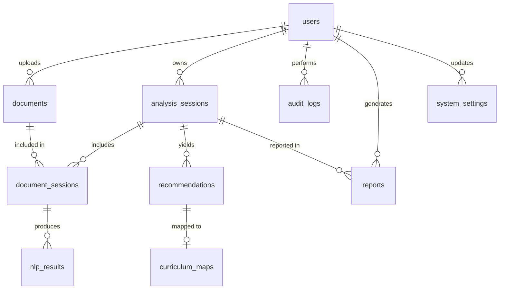

# Database

PostgreSQL 16 through SQLAlchemy 2, with schema changes managed by Alembic
(`backend/migrations`). Apply migrations with `flask db upgrade`. CI checks
that the models and migrations match (`flask db check`).

| Table | Purpose | Notable columns and constraints |
|---|---|---|
| `users` | Accounts (spec §11) | `username` and `email` unique; `role` ∈ {Admin, Curriculum Planner}; bcrypt `password_hash`; `is_active` |
| `documents` | Source documents | `source_category` (5 values), `file_type` ∈ {pdf, docx, txt, csv}, `processing_status` ∈ {Uploaded, Parsed, Failed}, `error_message`, unique `content_hash` (SHA-256), `extracted_text` (loaded only when needed), `word_count`, `page_count` |
| `analysis_sessions` | One analysis run | `status` ∈ {Pending, Processing, Completed, Failed}; `parameter_config` (JSON: threshold, weights, max recommendations, topic count); `progress_stage`; `heartbeat_at`; `corpus_results` (JSON: corpus keywords, skill demand, topics with centroid embeddings); `pipeline_info` (JSON: models, stage timings, counts, warnings) |
| `document_sessions` | Document ↔ session link (many-to-many) | Unique (`document_id`, `session_id`); `processing_order` |
| `nlp_results` | Output for each document in a session | `tfidf_keywords`, `ner_entities`, `topics` (JSON); `embedding` (JSON array, the mean of the document's passage vectors) |
| `recommendations` | Ranked candidate topics | Every score column has CHECK 0 ≤ score ≤ 1 (`ner_score`, `topic_score`, `novelty_score`, `composite_score`, `max_similarity`); `overlap_status`; `planner_decision` ∈ {Accepted, Rejected, null}; `rank`; `evidence` (JSON) |
| `curriculum_maps` | Proposed courses | Unique `rec_id` (one course per recommendation); `course_code` up to 20 characters (allows `UUY-CSC 411`); CHECK `credit_units` IN (1, 2, 3); `prerequisites` and `learning_outcomes` (JSON lists) |
| `reports` | Generated reports | `report_format` ∈ {pdf, docx}; `file_path`; `file_size` |
| `system_settings` | Admin-editable configuration | `key` (primary key, e.g. `nlp_defaults`); `value` (JSON); `updated_at`; `updated_by` |
| `audit_logs` | Security and review trail (§14) | `action_type` (for example LOGIN, LOGIN_FAILED, DOCUMENT_UPLOAD, SESSION_RUN, RECOMMENDATION_DECISION, MAPPING_CREATE, REPORT_GENERATE, USER_UPDATE, SETTINGS_UPDATE); `entity_type`/`entity_id`; `detail` (JSON) |

Enumerations are stored as readable strings with CHECK constraints (see
`docs/DECISIONS.md`). Deleting a session cascades to its links, NLP results,
recommendations, mappings and reports. Deleting a document removes its file
and session links, and is refused while a processing session uses it.

## Migrations

| Revision | Change |
|---|---|
| `30fcec4b01cf` | Initial schema: all spec §11 entities |
| `26c538cfb329` | Document parsing fields (hash, text, word and page counts) |
| `5dc5d3148a7f` | Session corpus results and pipeline info |
| `e8b8d83ca9d0` | Recommendation rank and evidence |
| `12420769c5a4` | Reports table |
| `49eb1962fdba` | Session heartbeat (stale-run detection) |
| `7c1d2e3f4a5b` | Spec v2 alignment: Viewer and Flagged removed (existing rows become Curriculum Planner and pending), `csv` file type, one mapping per recommendation (duplicates removed, keeping the oldest), longer course codes, `system_settings` table |
